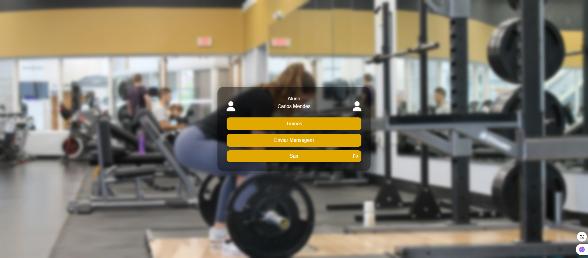
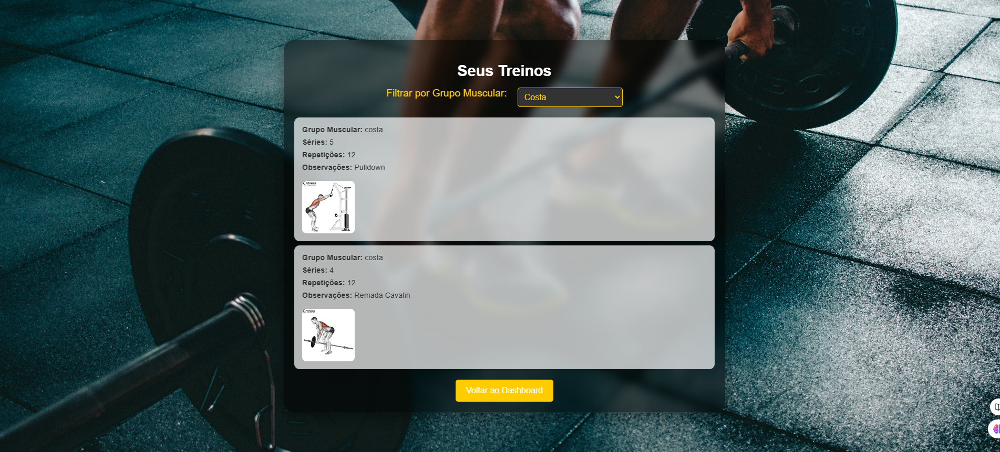

# Gerenciador de Alunos e Treinos para Personal Trainers

Este é um sistema de gerenciamento desenvolvido para personal trainers que desejam organizar e administrar alunos e treinos de musculação. O projeto foi criado como parte do curso de Ciência da Computação, utilizando as seguintes tecnologias: **HTML**, **CSS**, **Node.js**, **Express**, **SQLite3** e **SQLite3**.

## Funcionalidades

- **Cadastro de Alunos**: Possibilidade de adicionar, visualizar, editar e excluir alunos.
- **Gestão de Treinos**: Cadastro e gerenciamento de treinos associados a cada aluno.
- **Interface Intuitiva**: Uma interface amigável para facilitar a navegação e usabilidade.
- **Banco de Dados Local**: Os dados são armazenados em um banco de dados SQLite3.

## Tecnologias Utilizadas

- **Frontend**:
  - HTML5
  - CSS3
- **Backend**:
  - Node.js
  - Express.js
- **Banco de Dados**:
  - SQLite3


## Pré-requisitos

Antes de executar o projeto, você precisará ter instalado:

- **Node.js** (versão 14 ou superior)
- **SQLite3**
- **SQLite**

## Como Executar

1. **Clone o repositório**:
```bash
   git clone https://github.com/Fernando32117/projeto-faculdade.git

   cd projeto-faculdade
```

2. **Instalar as dependências**:

- Instale as dependências do projeto:

```bash  
npm install
```

3. **Executar a aplicação**:

- Execute a aplicação:

```bash  
node server/server.js
```

## Desenvolvedor

- **Nome**: [Francisco Fernando]
- **LinkedIn**: [Fernando Souza](https://www.linkedin.com/in/gerfernandosouza/)
- **GitHub**: [Fernando32117](https://github.com/Fernando32117)
- **Contato**: [nando32117@gmail.com]
- **Curso**: Ciência da Computação

## Screenshots

### Tela Inicial


### Tela de Login do Personal Trainer


### Tela de dashboard do Personal Trainer


### Tela de Login do Aluno


### Tela de dashboard do Aluno


### Tela de Treinos do Aluno



## Licença

[MIT](https://choosealicense.com/licenses/mit/)
